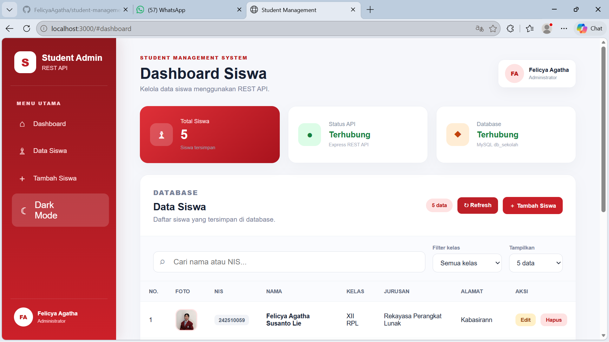
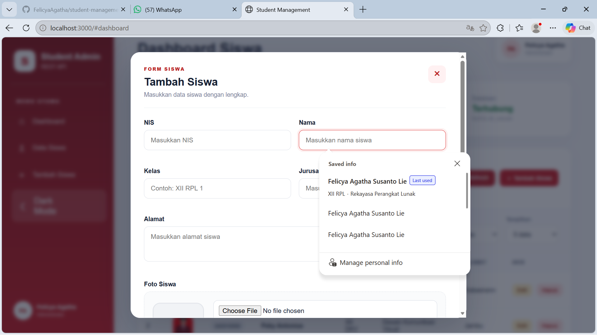
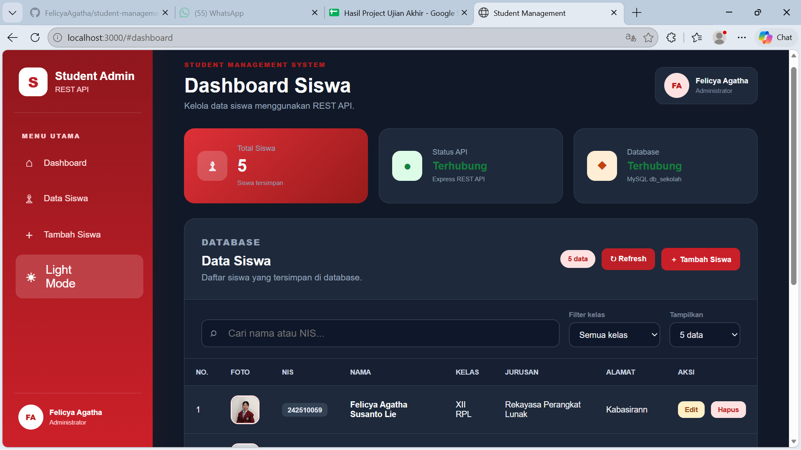
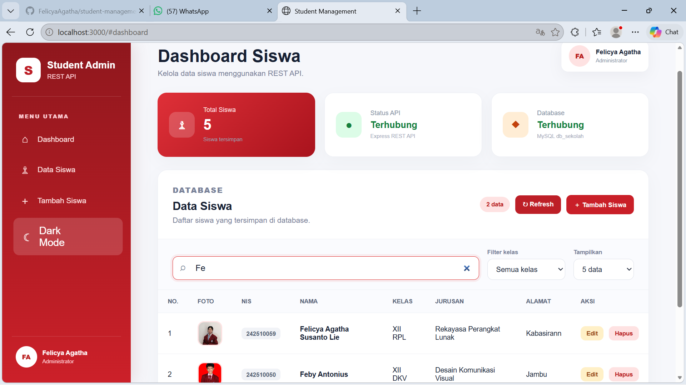

# Student Management REST API

Aplikasi manajemen data siswa berbasis REST API untuk mengelola data siswa melalui halaman dashboard. Aplikasi ini dibuat menggunakan Node.js, Express.js, MySQL, HTML, CSS, dan JavaScript.

## Live Demo

Aplikasi dapat diakses melalui:

https://student-management-rest-api-production-f875.up.railway.app

## Fitur

- Menampilkan seluruh data siswa
- Menampilkan jumlah siswa
- Menambahkan data siswa
- Mengubah data siswa
- Menghapus data siswa
- Mengunggah foto siswa
- Validasi NIS agar tidak sama
- Pencarian berdasarkan nama atau NIS
- Filter berdasarkan kelas
- Pagination atau pembagian halaman
- Dark mode
- Tampilan responsif
- Status koneksi API dan database
- REST API CRUD
- Database MySQL online

## Teknologi yang Digunakan

### Backend

- Node.js
- Express.js
- MySQL2
- Multer
- CORS

### Frontend

- HTML5
- CSS3
- JavaScript
- Fetch API

### Tools dan Deployment

- Visual Studio Code
- Git dan GitHub
- Postman
- HeidiSQL
- Railway

## Tampilan Aplikasi

### Dashboard



### Form Tambah Siswa



### Dark Mode



### Pencarian dan Filter



## Struktur Folder

```text
student-management-rest-api/
├── config/
│   └── database.js
├── public/
│   ├── uploads/
│   ├── index.html
│   ├── style.css
│   └── script.js
├── screenshots/
│   ├── dashboard.png
│   ├── tambah-siswa.png
│   ├── dark-mode.png
│   └── pencarian.png
├── .gitignore
├── package.json
├── package-lock.json
├── README.md
└── server.js
```

## Endpoint REST API

| Method | Endpoint | Keterangan |
|---|---|---|
| GET | `/api` | Memeriksa status REST API |
| GET | `/api/siswa` | Mengambil seluruh data siswa |
| GET | `/api/siswa/:id` | Mengambil satu siswa berdasarkan ID |
| POST | `/api/siswa` | Menambahkan data siswa |
| PUT | `/api/siswa/:id` | Mengubah data siswa |
| DELETE | `/api/siswa/:id` | Menghapus data siswa |

## Struktur Data Siswa

| Field | Tipe Data | Keterangan |
|---|---|---|
| id | INT | ID siswa dan primary key |
| nis | VARCHAR | Nomor Induk Siswa |
| nama | VARCHAR | Nama lengkap siswa |
| kelas | VARCHAR | Kelas siswa |
| jurusan | VARCHAR | Jurusan siswa |
| alamat | TEXT | Alamat siswa |
| foto | VARCHAR | Nama file foto siswa |
| created_at | TIMESTAMP | Waktu data dibuat |

## Contoh Request Tambah Siswa

Endpoint:

```http
POST /api/siswa
```

Data dikirim menggunakan `form-data`:

```text
nis      : 24251059
nama     : Felicya Agatha
kelas    : XII RPL
jurusan  : Rekayasa Perangkat Lunak
alamat   : Parungpanjang
foto     : file gambar
```

## Instalasi Project

Clone repository:

```bash
git clone https://github.com/FelicyaAgatha/student-management-rest-api.git
```

Masuk ke folder project:

```bash
cd student-management-rest-api
```

Instal semua dependency:

```bash
npm install
```

Jalankan server:

```bash
npm start
```

Server akan berjalan di:

```text
http://localhost:3000
```

## Konfigurasi Database

Aplikasi menggunakan environment variable berikut:

```env
DB_HOST=localhost
DB_USER=root
DB_PASSWORD=
DB_NAME=db_sekolah
DB_PORT=3306
```

Struktur tabel MySQL:

```sql
CREATE TABLE siswa (
    id INT AUTO_INCREMENT PRIMARY KEY,
    nis VARCHAR(30) NOT NULL UNIQUE,
    nama VARCHAR(100) NOT NULL,
    kelas VARCHAR(50) NOT NULL,
    jurusan VARCHAR(100) NOT NULL,
    alamat TEXT NOT NULL,
    foto VARCHAR(255) NULL,
    created_at TIMESTAMP DEFAULT CURRENT_TIMESTAMP
);
```

## Pengujian API

REST API dapat diuji menggunakan Postman dengan memilih method dan endpoint yang sesuai.

Contoh:

```http
GET http://localhost:3000/api/siswa
```

Contoh respons:

```json
{
    "status": true,
    "message": "Data siswa berhasil diambil",
    "data": []
}
```

## Deployment

Aplikasi telah di-deploy menggunakan Railway dengan:

- Web service Node.js
- Database MySQL Railway
- Environment variables
- Domain publik Railway

## Pembuat

**Felicya Agatha Susanto Lie**  
Kelas XII Rekayasa Perangkat Lunak  
SMK Bina Putra Mandiri